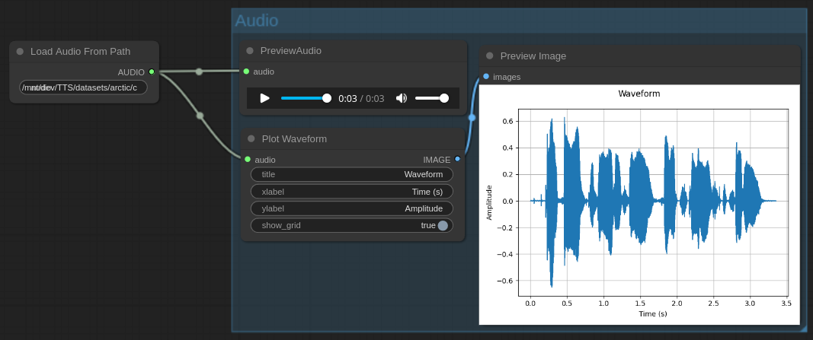

# comfyui-audio-plugin
> A collection of nodes for working with audio data.

- [Workflows](#workflows)
  - [Plot Waveform](#plot-waveform)
- [Nodes](#nodes)
  - [I/O](#io)
  - [Filter Banks](#filter-banks)
  - [Plotting](#plotting)
  - [Spectrogram](#spectrogram)
- [License](#license)

> [!NOTE]
>
> This plugin is compatible with the ComfyUI audio nodes.

## Workflows

### Plot Waveform

## Nodes

### I/O

| Name                 | Description                                                                         |
|----------------------|-------------------------------------------------------------------------------------|
| Load Audio From Path | Same as "Load Audio" but loads from a local path instead of an uploaded audio file. |

### Filter Banks

| Name                  | Description                                         |
|-----------------------|-----------------------------------------------------|
| Mel-scale Filter Bank | Create a mel-scale filter bank.                     |
| Apply Filter Bank     | Apply the specified filter bank to the spectrogram. |

### Plotting

| Name                       | Description                                |
|----------------------------|--------------------------------------------|
| Plot Waveform              | Plots the waveform of an `AUDIO` object.   |
| Plot Spectrogram           | Plots the spectrogram of a `SPECT` object. |
| Plot Filter Bank           | Plots the `FILTER_BANK` object.            |

### Spectrogram

| Name                  | Description                                                                    |
|-----------------------|--------------------------------------------------------------------------------|
| Spectrogram           | Computes the spectrogram of a given `AUDIO` object.                            |
| Inverse Spectrogram   | Converts a complex-valued spectrogram to `AUDIO`.                              |
| Griffin Lim           | Converts a real-valued spectrogram to `AUDIO` using the Griffin-Lim algorithm. |

A spectrogram (`SPECT`) can be one of three types:
1. `complex` &ndash; a complex number valued spectrogram;
2. `magnitude` &ndash; a real valued spectrogram that is the absolute value of the `complex` spectrogram (power 1);
3. `power` &ndash; a real valued spectrogram that is the square of the `magnitude` spectrogram (power 2);

## License
Copyright (C) 2024 Reece H. Dunn

SPDX-License-Identifier: [GPL-3](LICENSE)
